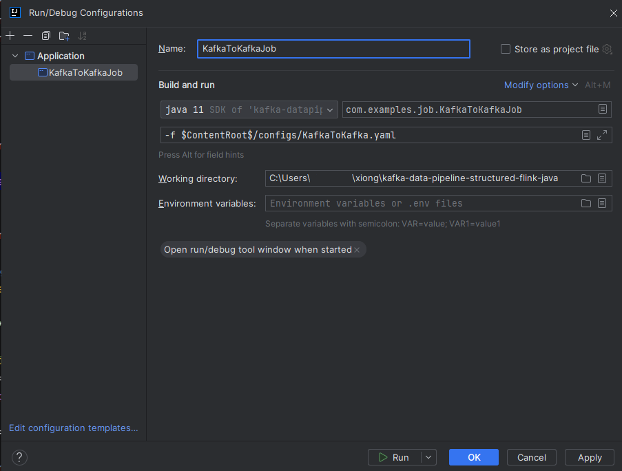

# Kafka Data Pipeline Flink

使用 Flink 編寫的資料管道，用於將 Kafka 資料傳輸到 Kafka、Doris，也支援合併兩個資料來源。  

## Overview

- 平台：JDK 11  
- 建構工具：Apache Maven v3.9.6  
- 資料處理框架：Flink v1.18.1  

## Run
使用 IntelliJ IDEA  
  

## Entry

### 1. KafkaToKafka  

將 Kafka (localhost:9092) 中 `topic-source` 的所有產品訊息傳輸到 Kafka 中的 `topic-sink`。  

- Kafka 主題 `topic-source` 訊息範例  
```json
{
    "id": "12345",
    "name": "Wireless Mouse",
    "category": "Electronics",
    "manufacturer": "TechCorp",
    "description": "A sleek, ergonomic wireless mouse with advanced optical tracking.",
    "cost": 29.99
}
```  

### 2. KafkaToDoris  

將 Kafka (localhost:9092) 中 `topic-product` 的所有訊息轉換後插入 Doris (localhost:9030) 資料庫 `database.product` 中。  

- Kafka 主題 `topic-product` 訊息範例  
```json
{
    "id": "12345",
    "name": "Wireless Mouse",
    "category": "Electronics",
    "manufacturer": "TechCorp",
    "description": "A sleek, ergonomic wireless mouse with advanced optical tracking.",
    "cost": 29.99
}
```  

- Doris 資料表 `database.product`  
```
| id      | name            | category    | manufacturer  | description                       | cost  |
|---------|-----------------|-------------|---------------|-----------------------------------|-------|
| 12345   | Wireless Mouse  | Electronics | TechCorp      | A sleek, ergonomic wireless mouse | 29.99 |
```  

### 3. TwoKafkaToDoris  

將 Kafka (localhost:9092) 中 `topic-product` 與 `topic-sale` 的訊息結合後，傳輸到 Doris (localhost:9030) 資料庫 `database.sale_report` 中。  

- Kafka 主題 `topic-product` 訊息範例  
```json
{
    "id": "12345",
    "name": "Wireless Mouse",
    "category": "Electronics",
    "manufacturer": "TechCorp",
    "description": "A sleek, ergonomic wireless mouse with advanced optical tracking.",
    "cost": 29.99
}
```  

- Kafka 主題 `topic-sale` 訊息範例  
```json
{
    "id": "A98765",
    "productId": "12345",
    "unit": 3,
    "unitPrice": 49.99,
    "totalPrice": 149.97,
    "saleDate": "2024-11-28"
}
```  

- Doris 資料表 `database.sale_report`  
```
| sale_id   | product_id | unit | unit_price | total_price | sale_date            | product_name  | product_unit_cost | profit |
|-----------|------------|------|------------|-------------|----------------------|---------------|-------------------|--------|
| A98765    | 12345      | 3    | 49.99      | 149.97      | 2024-11-28T08:00:00  | Wireless Mouse| 29.99             | 60.00  |
```  