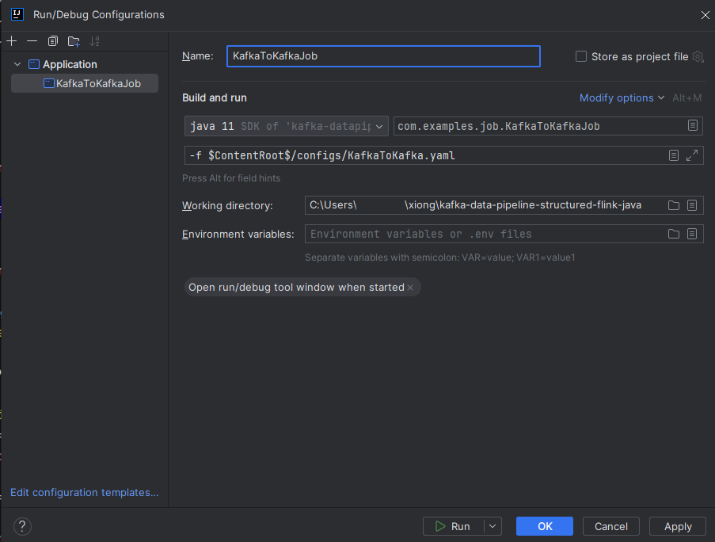

# Kafka Data Pipeline Flink
Data pipeline written by flink to transfer Kafka to Kafka, Doris and also merge the two data sources.  

## Overview

- Platform: JDK 11
- Build Tool: Apache Maven v3.9.6
- Data Processing Framework: Flink v1.18.1


## Run
Use IntelliJ IDEA  



## Entry

### 1. KafkaToKafka

Transfer all Product messages from `topic-source` in Kafka (localhost:9092) to `topic-sink` in Kafka (localhost:9092).  

- Kafka Topic `topic-source` Message
```json
{
    "id": "12345",
    "name": "Wireless Mouse",
    "category": "Electronics",
    "manufacturer": "TechCorp",
    "description": "A sleek, ergonomic wireless mouse with advanced optical tracking.",
    "cost": 29.99
}
```

### 2. KafkaToDoris

Convert all message in `topic-product` in Kafka (localhost:9092) and insert it into the Doris (localhost:9030) database `database.product`.  

- Kafka Topic `topic-product` Message
```json
{
    "id": "12345",
    "name": "Wireless Mouse",
    "category": "Electronics",
    "manufacturer": "TechCorp",
    "description": "A sleek, ergonomic wireless mouse with advanced optical tracking.",
    "cost": 29.99
}
```


- Doris Table `database.product`
- 
| id      | name            | category    | manufacturer  | description                       | cost  |
|---------|-----------------|-------------|---------------|-----------------------------------|-------|
| 12345   | Wireless Mouse  | Electronics | TechCorp      | A sleek, ergonomic wireless mouse | 29.99 |


### 3. TwoKafkaToDoris
Combine message `topic-product` in Kafka (localhost:9092) with message from `topic-sale`. Then, transfer the resulting data into the Doris (localhost:9030) database `database.sale_report`.  

- Kafka Topic `topic-product` Message
```json
{
    "id": "12345",
    "name": "Wireless Mouse",
    "category": "Electronics",
    "manufacturer": "TechCorp",
    "description": "A sleek, ergonomic wireless mouse with advanced optical tracking.",
    "cost": 29.99
}
```

- Kafka Topic `topic-sale` Message
```json
{
    "id": "A98765",
    "productId": "12345",
    "unit": 3,
    "unitPrice": 49.99,
    "totalPrice": 149.97,
    "saleDate": "2024-11-28"
}
```

- Doris Table `database.sale_report`


| sale_id   | product_id | unit | unit_price | total_price | sale_date            | product_name  | product_unit_cost | profit |
|-----------|------------|------|------------|-------------|----------------------|---------------|-------------------|--------|
| A98765    | 12345      | 3    | 49.99      | 149.97      | 2024-11-28T08:00:00  | Wireless Mouse| 29.99             | 60.00  |
